# latihan3
## PARAMETER "END"
paramenter end itu berfungsi untuk mengganti karakter terakhir yang ada dibawah yang dicetak di layarcontohnya sebagao berikut:
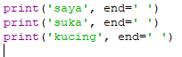
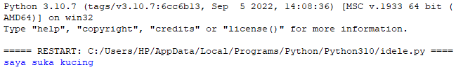
## PARAMETER "SEPARATOR (SEP)"
Ketika pengguna memanggil fungsi print() untuk menampilkan multi argumen, python akan otomatis menambahkan karakterspasi sebagai pemisah spasi, maka kita bisa menambahkan parameter sep(separator) saat memanggil print() sebagai contohnya:
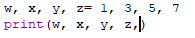
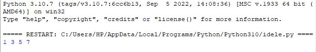
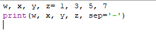

## string format 
string sendiri adalah potongan teks. mereka dapat didefinisikan sebagai apa saja di antara tanda kutip. berikut ini adalah contoh python string format contoh sebagai berikut:
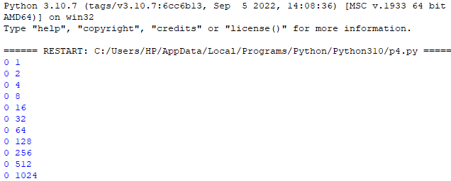
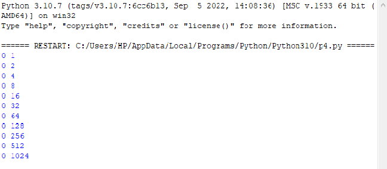
## string format
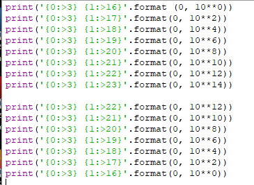
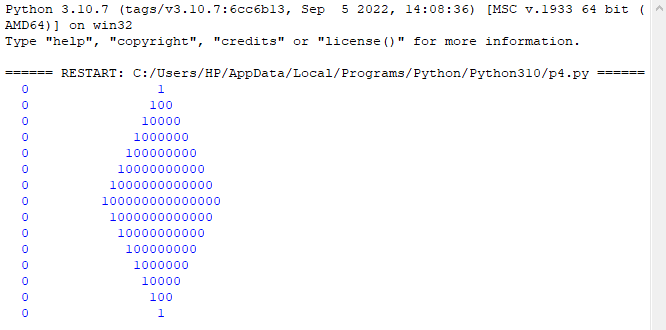
## latihan 2
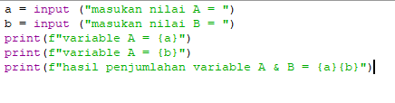
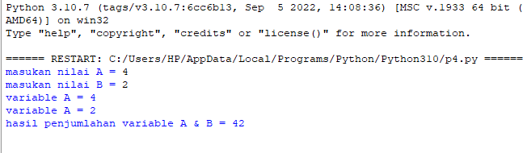
## latihan 3
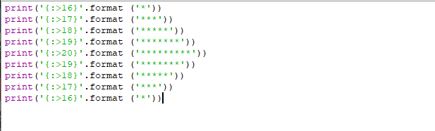
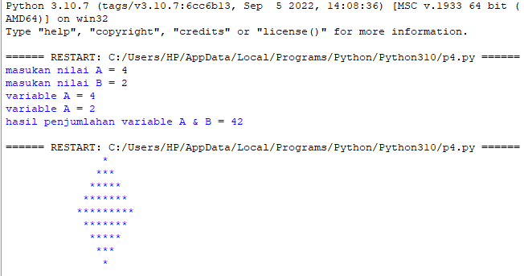
## membuat rumus lingkaran dan flowchart
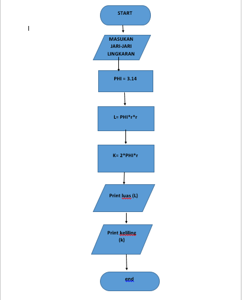
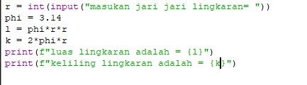
